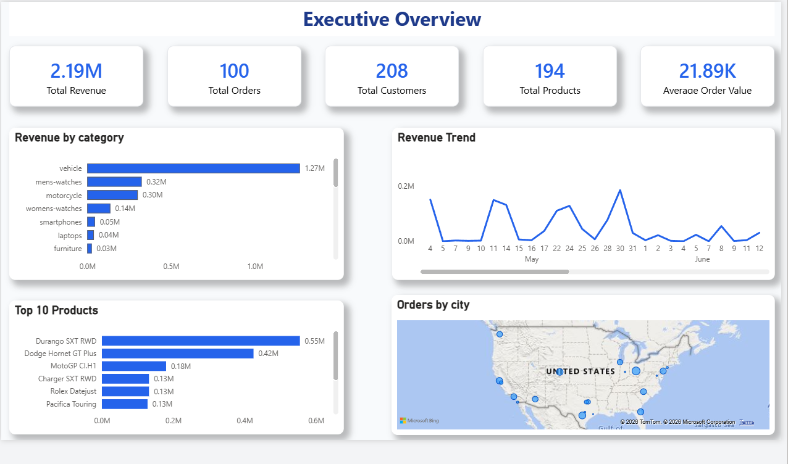
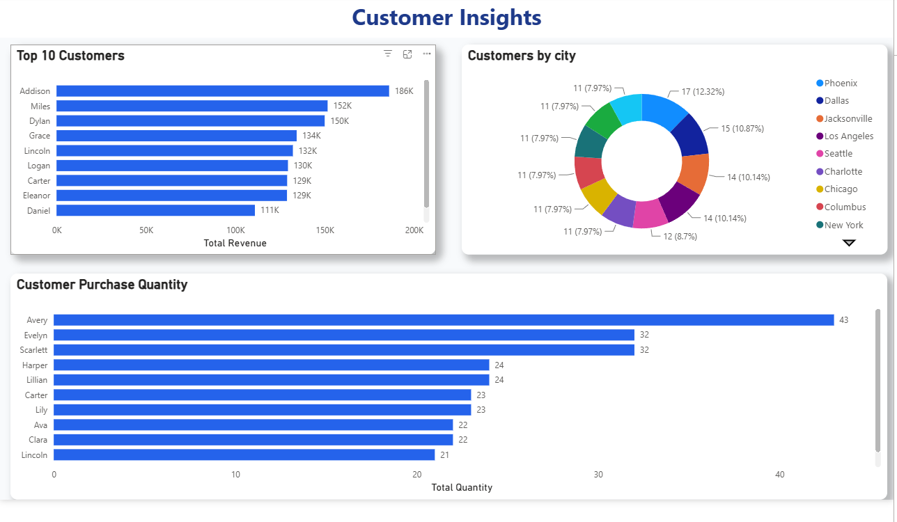
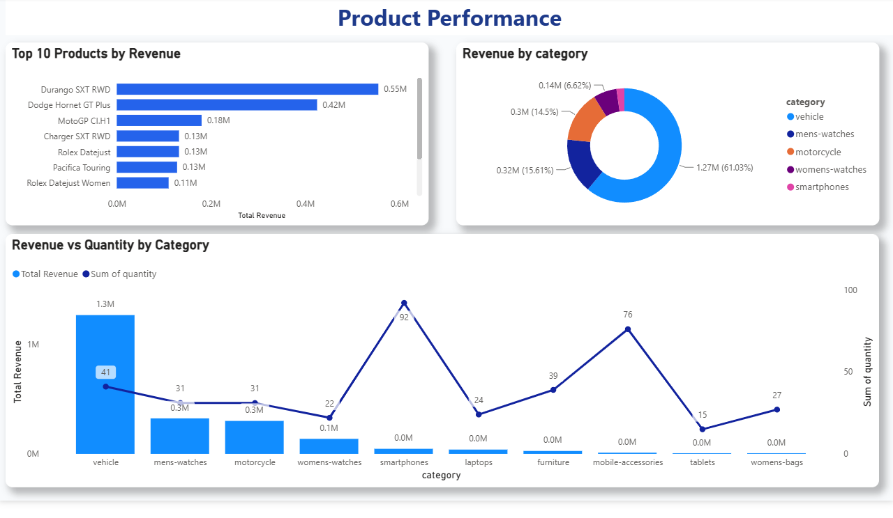
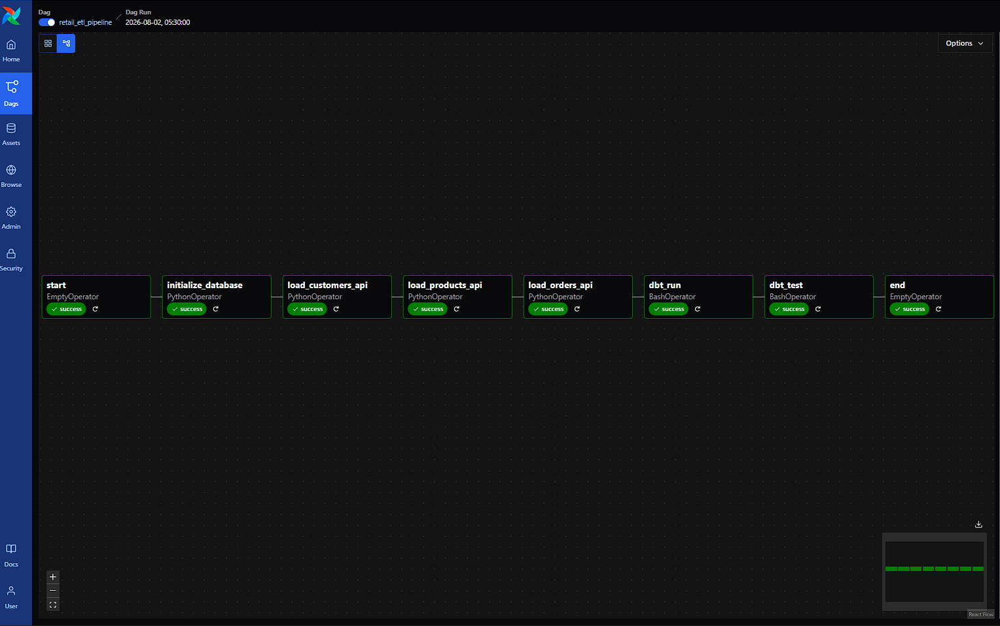
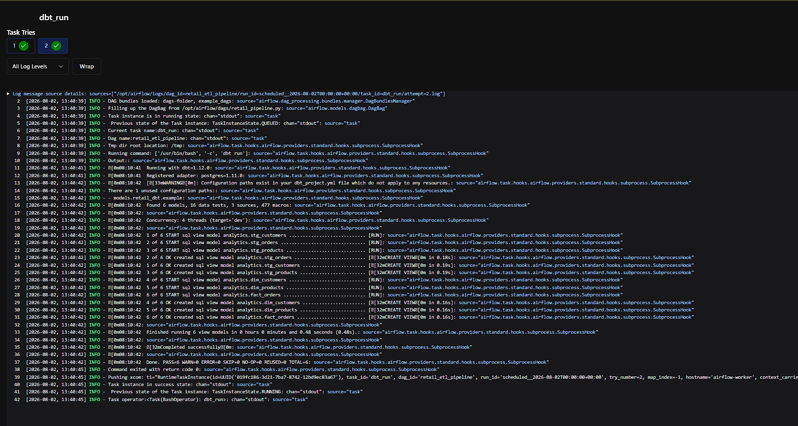

# 🚀 Automated Retail ETL Data Pipeline

An end-to-end **Data Engineering** project that automates the extraction, validation, transformation, and loading of retail data from the DummyJSON REST API into PostgreSQL using **Python**, **Apache Airflow**, **dbt**, and **Docker**, with interactive business insights delivered through **Power BI**.

---

# 📑 Table of Contents

- <a href="#project-overview">📌 Project Overview</a>
- <a href="#architecture">🏗 Architecture</a>
- <a href="#features">✨ Features</a>
- <a href="#tech-stack">🛠 Tech Stack</a>
- <a href="#project-structure">📂 Project Structure</a>
- <a href="#pipeline-workflow">⚙ Pipeline Workflow</a>
- <a href="#power-bi-dashboard">📊 Power BI Dashboard</a>
- <a href="#screenshots">📸 Screenshots</a>
- <a href="#running-the-project">🚀 Running the Project</a>
- <a href="#documentation">📚 Documentation</a>
- <a href="#future-improvements">🔮 Future Improvements</a>
- <a href="#author">👨‍💻 Author</a>

---

<h2 id="project-overview">📌 Project Overview</h2>

This project demonstrates an end-to-end Retail Analytics Data Pipeline built using modern Data Engineering tools.

The pipeline extracts customer, product, and order data from the DummyJSON REST API, validates and transforms it using Python, stores raw data in PostgreSQL, builds analytics-ready models with dbt, orchestrates workflows using Apache Airflow, and visualizes business insights through interactive Power BI dashboards.

---

<h2 id="architecture">🏗 Architecture</h2>

DummyJSON REST API
          │
          ▼
   Apache Airflow (daily DAG, orchestration + retries)
          │
          ▼
   Python ETL (extract → validate → map → load)
          │
          ▼
   PostgreSQL — raw schema (system of record)
          │
          ▼
   dbt staging models (clean, standardize, test)
          │
          ▼
   dbt mart models (dimensional: facts + dimensions)
          │
          ▼
   Power BI (Executive / Customer / Product dashboards)

---

<h2 id="features">✨ Features</h2>

- Automated ETL pipeline
- REST API integration
- Data validation
- Data transformation
- PostgreSQL data warehouse
- Apache Airflow orchestration
- dbt staging and mart models
- dbt data quality tests
- Docker containerization
- Interactive Power BI dashboards

---

<h2 id="tech-stack">🛠 Tech Stack</h2>

| Category | Technology |
|----------|------------|
| Programming | Python |
| Database | PostgreSQL |
| Orchestration | Apache Airflow |
| Data Transformation | dbt |
| Visualization | Power BI |
| Containerization | Docker |
| Data Source | DummyJSON REST API |

---

<h2 id="project-structure">📂 Project Structure</h2>
```text
Automated-ETL-Data-Pipeline/
│
├── airflow/
│   ├── dags/
│   │   └── retail_pipeline.py       # Main DAG: retail_etl_pipeline
│   ├── config/                      # Airflow configuration
│   ├── docker-compose.yaml          # Airflow + PostgreSQL services
│   └── Dockerfile                   # Custom Airflow image (adds dbt + project deps)
│
├── database/
│   └── sql/init/                    # Raw schema DDL (customers, products, orders)
│
├── python/
│   ├── api/
│   ├── config/
│   ├── database/
│   ├── etl/
│   ├── mappers/
│   ├── validators/
│   └── utils/
│
├── retail_dbt/
│   ├── models/
│   │   ├── staging/
│   │   └── marts/
│   │       ├── dimensions/
│   │       └── facts/
│   ├── dbt_project.yml
│   └── profiles.yml
│
├── powerbi/
│   └── Retail Sales Analytics Dashboard.pbix
│
├── docs/
├── screenshots/
├── requirements.txt
└── README.md
```
---

<h2 id="pipeline-workflow">⚙ Pipeline Workflow</h2>

```text
DummyJSON API
      │
      ▼
Apache Airflow
      │
      ▼
Python ETL
      │
      ▼
PostgreSQL (Raw Layer)
      │
      ▼
dbt Staging Models
      │
      ▼
dbt Mart Models
      │
      ▼
Power BI Dashboard
```

---

<h2 id="power-bi-dashboard">📊 Power BI Dashboard</h2>

The .pbix file connects directly to the analytics schema and is organized into three report pages:

1. Executive Dashboard Top-level KPIs for quick business health checks: Total Revenue, Total Orders, Total Customers, Total Products.

2. Customer Insights Customer-level analysis: top customers by spend, order distribution by city, and overall customer segmentation.

3. Product Performance Product-level analysis: best-selling products, revenue by category, and stock/sales performance.

---

<h2 id="screenshots">📸 Screenshots</h2>

## Executive Dashboard



---

## Customer Insights



---

## Product Performance



---

## Airflow DAG



---

## Airflow Logs




---

<h2 id="running-the-project">🚀 Running the Project</h2>

### 1. Clone the Repository

```bash
git clone https://github.com/dhananjay-86/automated-retail-etl-pipeline-airflow-dbt-postgresql-docker.git
```

### 2. Install Dependencies

```bash
pip install -r requirements.txt
```

### 3. Start Docker Services

```bash
cd airflow
docker compose up -d
```

### 4. Open Airflow

```
http://localhost:8080
```

### 5. Trigger the DAG

Open the **retail_etl_pipeline** DAG and click **Trigger DAG**.

The workflow automatically:

- Initializes the PostgreSQL database
- Extracts data from the DummyJSON API
- Validates and transforms the data
- Loads data into PostgreSQL
- Executes dbt staging and mart models
- Runs dbt data quality tests

### 6. Refresh Power BI

Refresh the Power BI report to view the latest analytics.

---

<h2 id="documentation">📚 Documentation</h2>

Detailed documentation is available in the **docs/** folder.

- Project Overview
- Architecture
- Database Design
- ETL Pipeline
- Airflow Workflow
- dbt Models
- Power BI Dashboard
- Docker Setup
- Project Structure

---

<h2 id="future-improvements">🔮 Future Improvements</h2>

- Incremental API ingestion
- Automated Power BI refresh
- CI/CD pipeline
- Cloud deployment (AWS / Azure)

---

<h2 id="author">👨‍💻 Author</h2>

**Dhananjay Katre**

B.Tech Computer Science & Engineering

Aspiring Data Engineer | Data Analyst

### 📫 Contact

- **Email:** dhananjaykatre86@gmail.com
- **LinkedIn:** https://www.linkedin.com/in/dhananjay-katre-0418b63a2/

---