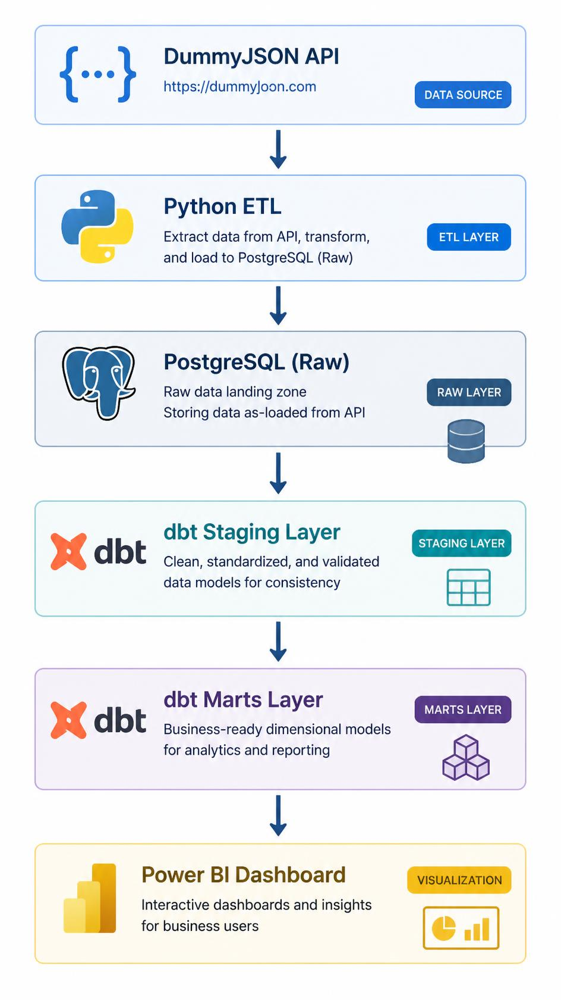

# Project Architecture

## Overview

The pipeline automatically extracts retail data from the DummyJSON API, processes it using Python ETL, stores raw data in PostgreSQL, transforms it with dbt, and visualizes business insights in Power BI.

---

## Architecture Flow

```
DummyJSON API
      │
      ▼
Apache Airflow
      │
      ▼
Python ETL
      │
      ▼
PostgreSQL (Raw)
      │
      ▼
dbt Staging
      │
      ▼
dbt Marts
      │
      ▼
Power BI Dashboard
```

---

## Components

| Component | Purpose |
|-----------|---------|
| DummyJSON API | Source of customers, products, and orders |
| Apache Airflow | Orchestrates the complete ETL workflow |
| Python ETL | Extracts, validates, transforms, and loads data |
| PostgreSQL | Stores raw and analytics-ready data |
| dbt | Builds staging and mart models with data quality tests |
| Power BI | Creates interactive dashboards and business insights |

---

## Architecture Diagram

